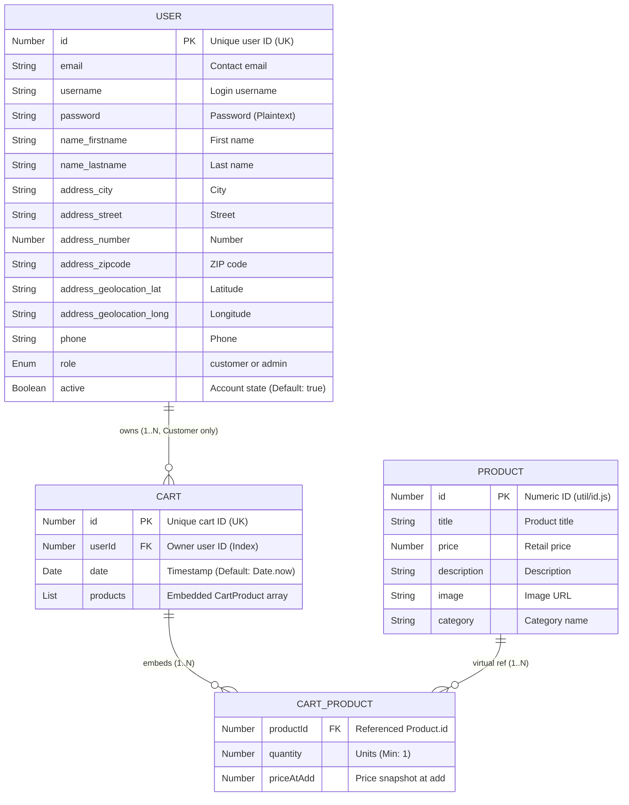
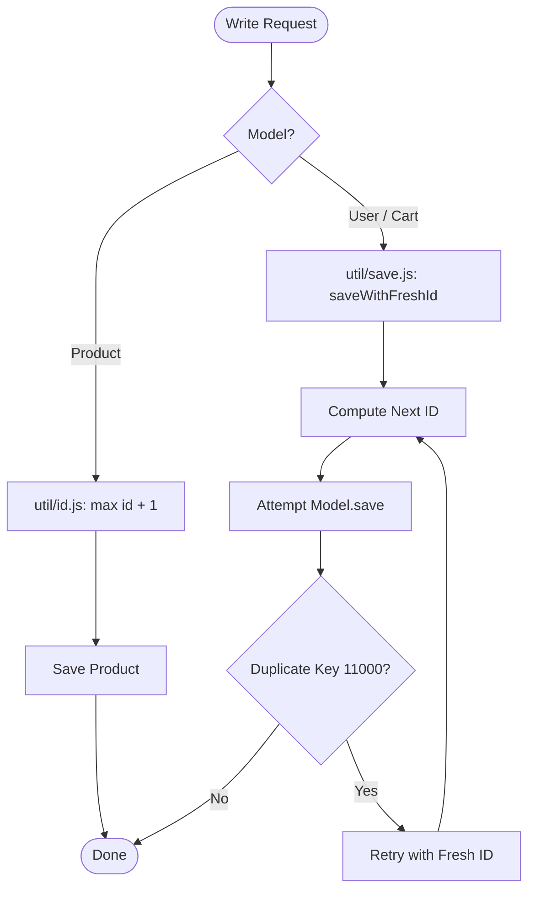

# Entity Relationship (ER) Diagram & Data Architecture

> Data models, relationships, schemas, and storage architecture for **FakeStoreAPI Local**.

---

## 1. Conceptual Data Model

Organized into three boundaries:
1. **Catalog**: `Product` — Standalone documents with title, price, category, description, and image.
2. **Carts**: `Cart` & `CartProduct` — Hybrid pattern: `Cart` references `User`; line items (`CartProduct`) are embedded subdocuments with snapshotted `priceAtAdd`.
3. **Identity**: `User` — Credentials, role (`customer` vs `admin`), account status (`active`), and embedded name/address.

---

## 2. Logical Entity Relationship Diagram (Mermaid)



---

## 3. Relationship & Cardinality Matrix

| Relationship | Cardinality | Storage | Reference Key | Cascade / Integrity Behavior |
| :--- | :--- | :--- | :--- | :--- |
| **`User` -> `Cart`** | 1 to 0..N | **Referenced** | `Cart.userId` -> `User.id` | Customer-only. No foreign key constraints in Mongo. Ownership enforced in controller: `req.user.id === cart.userId`. |
| **`Cart` -> `CartProduct`** | 1 to 0..N | **Embedded** (`_id: false`) | `Cart.products` array | Atomic lifecycle with parent cart. Schema validator blocks duplicate `productId` in the same cart. |
| **`Product` -> `CartProduct`** | 1 to 0..N | **Virtual Ref** | `CartProduct.productId` -> `Product.id` | Controller validates product exists and copies `price` to `priceAtAdd`. Past cart lines keep snapshot if product is later deleted. |

---

## 4. Enumerations & Constants

* **`UserRole`**:
  * `'customer'`: Private cart & profile access. Blocked from catalog writes and user admin.
  * `'admin'`: Product CRUD, user audits, account deactivation. Blocked from `/carts` (403).
* **`SortFields`**: `'id'` (default), `'name'`/`'title'` (case-insensitive `en` collation), `'price'`.
* **`SortDirection`**: `'asc'` (default), `'desc'`.

---

## 5. Mongoose Virtuals

```javascript
// Populate owning user
cartSchema.virtual('user', {
    ref: 'user',
    localField: 'userId',
    foreignField: 'id',
    justOne: true,
});

// Populate line item product
cartProductSchema.virtual('product', {
    ref: 'product',
    localField: 'productId',
    foreignField: 'id',
    justOne: true,
});

// Line subtotal getter
cartProductSchema.virtual('subtotal').get(function () {
    return this.priceAtAdd == null ? undefined : this.priceAtAdd * this.quantity;
});
```

---

## 6. Concurrency & ID Allocation



* **Products (`util/id.js`)**: Non-atomic `max(id) + 1`. No unique index; tolerates collisions like upstream FakeStoreAPI.
* **Users & Carts (`util/save.js`)**: Enforces `unique: true` on `id`. Uses `saveWithFreshId()` to catch MongoDB error `11000` and retry with next available ID under concurrent writes.
