# Entity Relationship (ER) Diagram & Data Architecture

> Logical data models, entity relationships, cardinality constraints, and foreign key integrity rules for the **E-Commerce Practice API**.

---

## 1. Conceptual Data Model

The domain is organized into 5 primary conceptual boundaries:
1. **Catalog & Taxonomy**: `Product`, `Category`, `Brand`
2. **Customer Feedback**: `Review`
3. **Shopping Experience**: `Cart`, `CartItem`, `Wishlist`, `WishlistItem` (Restricted to `Customer` and guest shoppers)
4. **Order Processing & Fulfillment**: `Order`, `OrderItem`, `Coupon` (Placed by customers, managed by `Admin` / `SuperAdmin`)
5. **Identity & Access Management**: `User`, `UserAddress` (Roles: `Customer`, `Admin`, `SuperAdmin`)

---

## 2. Logical Entity Relationship Diagram (Mermaid)

```mermaid
erDiagram
    CATEGORY ||--o{ CATEGORY : "has subcategories (0..N)"
    CATEGORY ||--o{ PRODUCT : "contains (1..N)"
    BRAND ||--o{ PRODUCT : "manufactures (1..N)"

    PRODUCT ||--o{ REVIEW : "receives (0..N)"
    PRODUCT ||--o{ CART_ITEM : "referenced in (0..N)"
    PRODUCT ||--o{ ORDER_ITEM : "ordered in (0..N)"
    PRODUCT ||--o{ WISHLIST_ITEM : "saved in (0..N)"

    USER ||--o{ REVIEW : "authors (0..N)"
    USER ||--o| CART : "owns (0..1, Customer only)"
    USER ||--o{ ORDER : "places (0..N, Customer only)"
    USER ||--o| WISHLIST : "maintains (0..1, Customer only)"
    USER ||--o{ USER_ADDRESS : "stores in address book (0..N)"

    CART ||--o{ CART_ITEM : "holds (0..N)"
    ORDER ||--o{ ORDER_ITEM : "includes (1..N)"
    ORDER }o--o| COUPON : "redeems (0..1)"
    WISHLIST ||--o{ WISHLIST_ITEM : "holds (0..N)"

    PRODUCT {
        UUID Id PK "Unique product identifier"
        String Title "Product display name"
        String Slug UK "URL-friendly SEO slug"
        String Description "Detailed description"
        Decimal Price "Base retail price"
        Decimal DiscountPercentage "Discount rate (0 - 99.99)"
        Decimal Rating "Average star rating (0.00 - 5.00)"
        Integer RatingCount "Total count of reviews"
        Integer Stock "Available inventory count"
        String SKU UK "Stock Keeping Unit code"
        UUID CategoryId FK "Associated category"
        UUID BrandId FK "Associated brand"
        String Thumbnail "Primary thumbnail image URL"
        List Images "Array of image URLs"
        List Tags "Search and filter keywords"
        Boolean IsFeatured "Homepage promotional badge"
        Boolean IsActive "Visible in public catalog"
        DateTime CreatedAtUtc "Creation timestamp"
        DateTime UpdatedAtUtc "Last update timestamp"
    }

    CATEGORY {
        UUID Id PK "Unique category identifier"
        String Name "Category name"
        String Slug UK "URL-friendly slug"
        String Description "Optional description"
        String ImageUrl "Optional category banner URL"
        UUID ParentCategoryId FK "Optional parent category for hierarchies"
    }

    BRAND {
        UUID Id PK "Unique brand identifier"
        String Name "Brand name"
        String Slug UK "URL-friendly slug"
        String LogoUrl "Brand logo image URL"
        String Website "Brand website URL"
    }

    REVIEW {
        UUID Id PK "Unique review identifier"
        UUID ProductId FK "Reviewed product (Unique with UserId)"
        UUID UserId FK "Author customer account"
        String ReviewerName "Display name of reviewer"
        String ReviewerEmail "Email of reviewer"
        Integer Rating "Star rating (1 to 5)"
        String Comment "Review comment text"
        DateTime CreatedAtUtc "Posted timestamp"
    }

    USER {
        UUID Id PK "Unique user identifier"
        String Email UK "Unique login email"
        String Username UK "Unique user handle"
        String PasswordHash "Hashed password"
        String FirstName "First name"
        String LastName "Last name"
        String PhoneNumber "Contact phone"
        String AvatarUrl "Profile avatar URL"
        Enum Role "Customer, Admin, SuperAdmin"
        Boolean IsActive "Account status flag"
        DateTime CreatedAtUtc "Registration timestamp"
    }

    USER_ADDRESS {
        UUID Id PK "Unique address identifier"
        UUID UserId FK "Owning customer"
        String Street "Street address and apartment/suite"
        String City "City name"
        String State "State / Province / Region"
        String PostalCode "ZIP / Postal code"
        String Country "Country name or ISO code"
        Boolean IsDefault "Primary default address flag"
    }

    CART {
        UUID Id PK "Unique cart identifier"
        UUID UserId FK "Optional owning Customer (null for guest cart)"
        Decimal Subtotal "Sum of line totals"
        Decimal DiscountTotal "Applied discount savings"
        Decimal GrandTotal "Final checkout total"
        DateTime UpdatedAtUtc "Last item added or updated"
    }

    CART_ITEM {
        UUID Id PK "Unique cart line item identifier"
        UUID CartId FK "Parent cart"
        UUID ProductId FK "Selected product"
        String ProductTitle "Cached product name"
        String ProductThumbnail "Cached thumbnail image"
        Decimal UnitPrice "Unit price at time of addition"
        Integer Quantity "Number of units selected"
    }

    ORDER {
        UUID Id PK "Unique order identifier"
        String OrderNumber UK "Human-readable order tracking reference"
        UUID UserId FK "Purchasing customer"
        DateTime CreatedAtUtc "Order placement timestamp"
        Enum Status "Pending, Processing, Shipped, Delivered, Cancelled"
        Enum PaymentStatus "Pending, Paid, Failed, Refunded"
        Enum PaymentMethod "CreditCard, PayPal, CashOnDelivery"
        Decimal Subtotal "Pre-tax pre-discount sum"
        Decimal TaxAmount "Calculated sales tax"
        Decimal ShippingFee "Shipping and handling charge"
        Decimal DiscountAmount "Coupon discount deducted"
        Decimal TotalAmount "Grand final billed amount"
        String ShippingAddressJson "Snapshot of delivery address"
        String TrackingNumber "Carrier shipment tracking code"
    }

    ORDER_ITEM {
        UUID Id PK "Unique order line item identifier"
        UUID OrderId FK "Parent order"
        UUID ProductId FK "Original product reference"
        String ProductTitle "Snapshot of product title at purchase"
        String ProductThumbnail "Snapshot of thumbnail at purchase"
        Decimal UnitPrice "Snapshot of unit price at purchase"
        Integer Quantity "Number of units purchased"
        Decimal LineTotal "Line total charged"
    }

    COUPON {
        UUID Id PK "Unique coupon identifier"
        String Code UK "Voucher code (e.g. SAVE20)"
        Enum DiscountType "Percentage or FixedAmount"
        Decimal DiscountValue "Value of reduction"
        Decimal MinPurchaseAmount "Minimum subtotal required to apply"
        DateTime ValidUntilUtc "Expiration timestamp"
        Boolean IsActive "Enabled flag"
    }

    WISHLIST {
        UUID Id PK "Unique wishlist identifier"
        UUID UserId FK "Owning customer (1:1)"
    }

    WISHLIST_ITEM {
        UUID Id PK "Unique wishlist item identifier"
        UUID WishlistId FK "Parent wishlist"
        UUID ProductId FK "Bookmarked product"
        DateTime AddedAtUtc "Timestamp added to wishlist"
    }
```

---

## 3. Relationship Cardinality Matrix

| Relationship | Cardinality | Foreign Key | Cascade / Deletion Behavior |
| :--- | :--- | :--- | :--- |
| `Category` -> `Category` (Parent/Child) | 1 to 0..N | `Category.ParentCategoryId` | On delete parent, set children `ParentCategoryId = null` (Orphan allowed). |
| `Category` -> `Product` | 1 to 0..N | `Product.CategoryId` | Restrict deletion if products exist in category. |
| `Brand` -> `Product` | 1 to 0..N | `Product.BrandId` | Restrict deletion if products exist under brand. |
| `Product` -> `Review` | 1 to 0..N | `Review.ProductId` | Cascade delete reviews when product is deleted. |
| `User` -> `Review` | 1 to 0..N | `Review.UserId` | One review per customer per product (unique composite key `ProductId + UserId`). If user is deleted, set `Review.UserId = null`. |
| `User` -> `UserAddress` | 1 to 0..N | `UserAddress.UserId` | Cascade delete addresses if user account is removed. An address has no billing/shipping distinction; one can be marked as `isDefault`. |
| `User` -> `Cart` | 1 to 0..1 | `Cart.UserId` | Available only for `Customer` accounts. Cascade delete active cart if customer is removed. |
| `Cart` -> `CartItem` | 1 to 0..N | `CartItem.CartId` | Cascade delete line items when cart is cleared/deleted. |
| `Product` -> `CartItem` | 1 to 0..N | `CartItem.ProductId` | If product is deleted, remove corresponding cart item. |
| `User` -> `Order` | 1 to 0..N | `Order.UserId` | Restrict user deletion if order history exists (financial audit trail). |
| `Order` -> `OrderItem` | 1 to 1..N | `OrderItem.OrderId` | Cascade delete items only if order itself is expunged. |
| `Product` -> `OrderItem` | 1 to 0..N | `OrderItem.ProductId` | **Preservation Rule**: If product is physically deleted from catalog, `OrderItem` retains `ProductTitle`, `ProductThumbnail`, and `UnitPrice` snapshots so past order receipts remain 100% intact. |
| `User` -> `Wishlist` | 1 to 0..1 | `Wishlist.UserId` | Cascade delete wishlist if user is removed. |
| `Wishlist` -> `WishlistItem`| 1 to 0..N | `WishlistItem.WishlistId` | Cascade delete wishlist items if wishlist is cleared. |

---

## 4. Enumeration Definitions

### 4.1. `UserRole`
* `Customer` (Standard shopper: catalog, cart, checkout, reviews, personal address book, own order history)
* `Admin` (Store manager: catalog CRUD, order fulfillment progression, carrier tracking, order cancellation; cart disabled)
* `SuperAdmin` (System owner: all Admin capabilities + user role promotion/demotion between Customer and Admin, user account activation/deactivation; cart disabled)

### 4.2. `OrderStatus`
* `Pending` (Order created, waiting for payment/verification)
* `Processing` (Payment confirmed, items packing in warehouse)
* `Shipped` (Dispatched to carrier with tracking number)
* `Delivered` (Successfully handed over to customer)
* `Cancelled` (Order revoked; inventory restored)

### 4.3. `PaymentStatus`
* `Pending` (Payment initiated, awaiting gateway)
* `Paid` (Transaction successfully settled)
* `Failed` (Card declined or gateway timeout)
* `Refunded` (Funds returned after cancellation)

### 4.4. `PaymentMethod`
* `Card`
* `MobileBanking`
* `CashOnDelivery`

### 4.5. `DiscountType`
* `Percentage` (e.g., 15 = 15% off)
* `FixedAmount` (e.g., 20.00 = $20 off)
